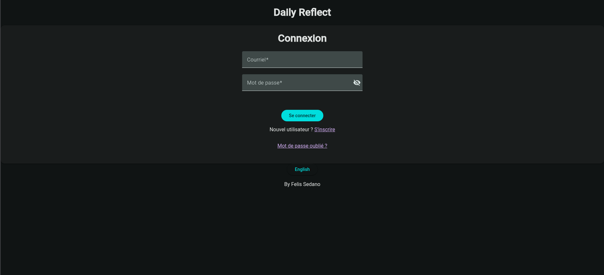

# daily-reflect

An online daily journaling web app that allows user to record memorable moments of the day, self-reflection, goal for the next day etc. Contains full localization support (French and English). 

Includes full authentication support
- Login
- Account registration
- Email verification
- Password reset

*Bonus feature*: 100% human-made. The main purpose of this project is to explore the best practices of software engineering. Throughout the development, tons of research was made about the software design/architecture, coding best practices, CI, internationalization, and most importantly security (as I am really interested in cyber security). Also, different code editors were used throughout the development (IntelliJ, Neovim, VSCodium, Eclipse, Zed) to explore their differences.

## Some screenshots:

More screenshots of the app can be found in [resource](resource) folder

## Tech stacks
- Spring Boot (Java)
- Spring Security
- Angular (Typescript)
- Flyway
- Postgres
- Docker

## Project Setup (run it locally)

### Prerequisites

- Java 21
- maven
- Docker
- Node and NPM

If you are using NixOS or Nix, simply run `nix develop` in the project root and you should have all the dependencies installed (Except for Docker)

### Setup environment

Setup the environment using the .env with the example template:
`mv .env.example .env`

After replacing the environment variables in `.env` with the relevant values, run `export $(cat .env | xargs)` to export all the environment variables in the `.env` file (needed by Flyway).

### To run server with a local mail server (Maildev)

`docker compose --profile dev up` to spin up the database and mail server.

`mvn flyway:migrate -f ./server/pom.xml` to create the database schemas

`mvn spring-boot:run -f ./server/pom.xml -Dspring-boot.run.profiles=dev` to run the server

Any email generated by the app server will be sent to Maildev, which you can access by visiting `localhost:1080`

### To run the server without a mail server (print email to the terminal)

`mvn spring-boot:run -f ./server/pom.xml -Dspring-boot.run.profiles=dev,mock`

### To run the frontend

`cd ui`

`npm install`

`ng serve`

visit `localhost:4200`
